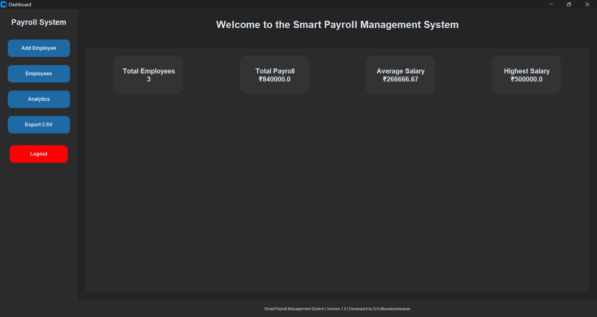
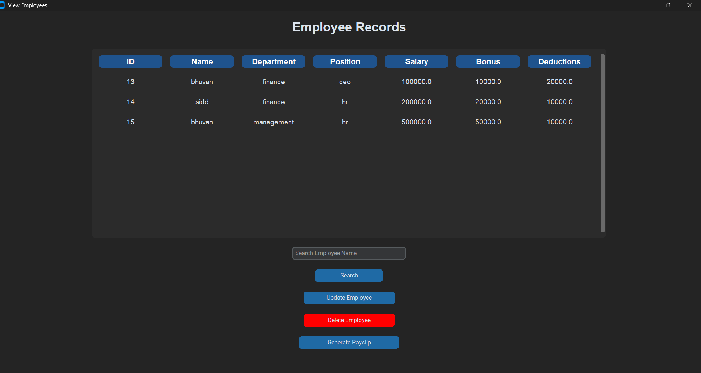
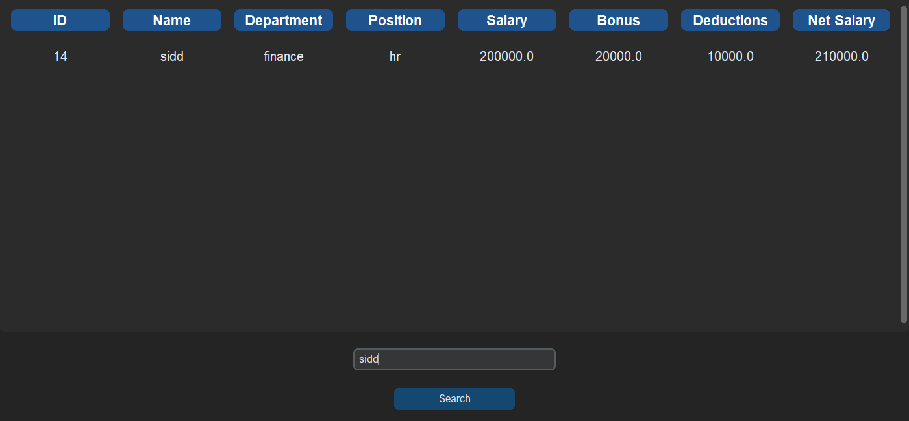
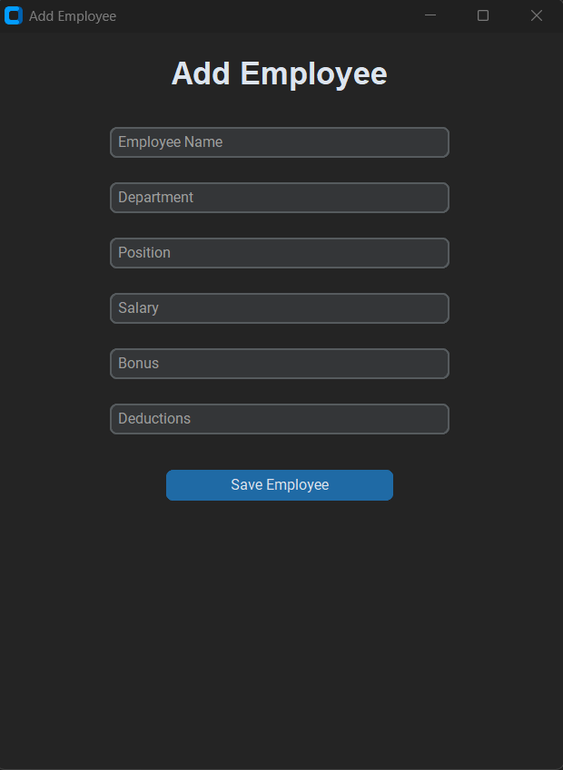
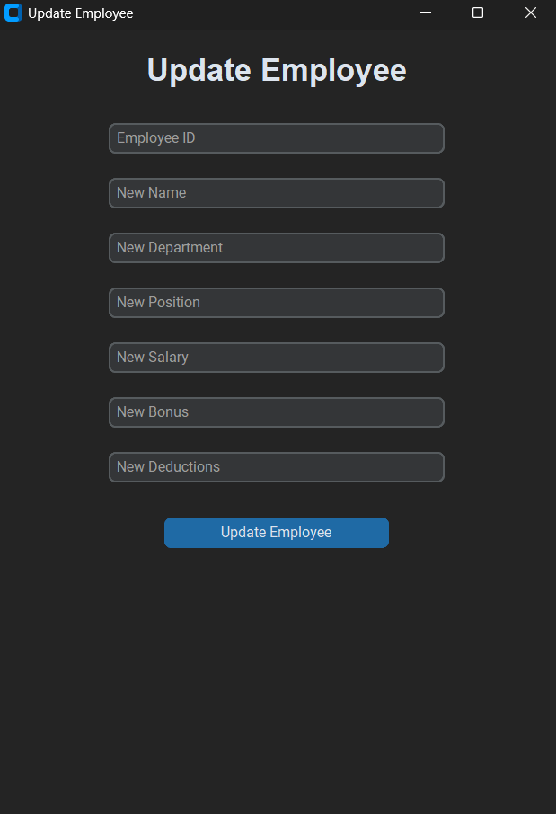
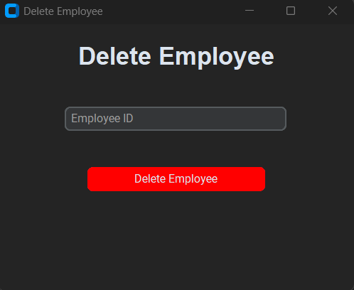
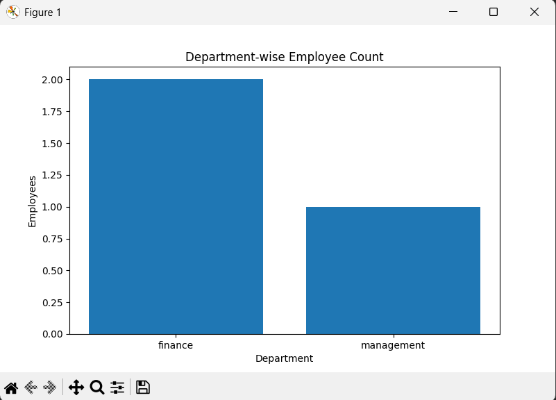
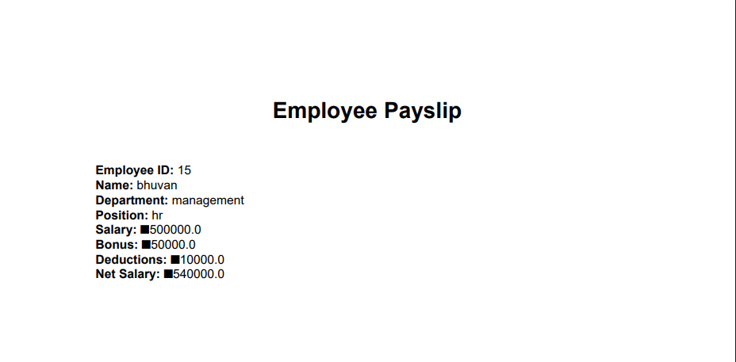
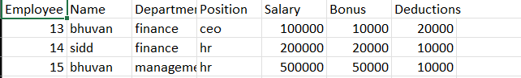

# Smart Payroll & Workforce Analytics Management System

A modern Payroll Management System built using Python, CustomTkinter, and MySQL with payroll analytics, PDF payslip generation, employee management, and CSV export functionality.

---

# 🚀 Features

## 👨‍💼 Employee Management
- Add Employee
- View Employees
- Update Employee
- Delete Employee
- Search Employees

## 💰 Payroll Management
- Automatic Net Salary Calculation
- Bonus & Deduction Handling
- Payroll Processing

## 📊 Analytics Dashboard
- Total Employees
- Total Payroll
- Average Salary
- Highest Salary
- Department-wise Analytics Chart

## 📄 Reports & Export
- PDF Payslip Generation
- CSV Report Export

## ✅ Validation & Error Handling
- Empty Field Validation
- Numeric Validation
- Invalid Employee Validation
- Auto Refresh Dashboard & Tables
- Responsive Employee Table

---

# 🛠️ Technologies Used

- Python
- CustomTkinter
- MySQL
- Pandas
- Matplotlib
- ReportLab

---

# 📁 Project Structure

```text
payroll-management-system/
│
├── analytics/
├── database/
├── gui/
├── models/
├── screenshots/
├── main.py
├── README.md
└── requirements.txt
```

---

# ⚙️ Installation & Setup

## 1️⃣ Clone Repository

```bash
git clone <your-github-repo-link>
```

## 2️⃣ Install Dependencies

```bash
pip install -r requirements.txt
```

## 3️⃣ Configure MySQL Database

Create a MySQL database and required tables.

## 4️⃣ Run Application

```bash
python main.py
```

---

# 📸 Screenshots

## 🔐 Login Page


---

## 📊 Dashboard



---

## 👨‍💼 Employee Records



---

## 🔍 Employee Search



---

## ➕ Add Employee



---

## ✏️ Update Employee



---

## ❌ Delete Employee



---

## 📈 Analytics Dashboard



---

## 📄 PDF Payslip



---

## 📁 CSV Export



---

# 🔮 Future Improvements

- Multi-user Authentication
- Cloud Database Integration
- Employee Attendance Tracking
- Email Payslip Support
- Admin/User Roles

---

# 👨‍💻 Developed By

G N Bhuvaneshwaran

B.Tech CSE Student | Python Developer